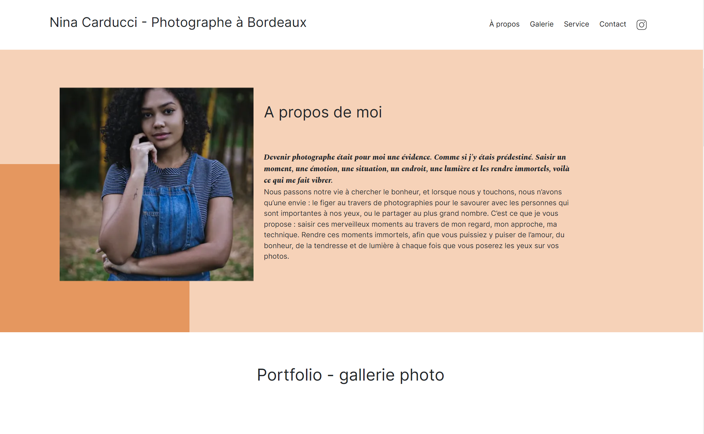

# 08_NinaCarducci

Artist's Website where te task was to improve loading time and it's SEO. This project is part of my OpenClassroom's course to become a web developer.

The modifications made for optimization where based on the results of the Lighthouse audit and the accessibility check using the Wave extension.

## Table of contents

- [Overview](#overview)
  - [The challenge](#the-challenge)
  - [Screenshot](#screenshot)
  - [Links](#links)
- [My process](#my-process)
  - [Built with](#built-with)
- [Author](#author)

## Overview

### The challenge

- Overall optimization of the site for both performance and SEO.
- Implementation of local SEO using Schema.org.
- Addition of metas for social networks.
- Modifications related to site accessibility.
- Production of an optimization report detailing all actions and their impact.

### Screenshot

### Links

- Live Site URL: [Nina Carducci](https://hregniez.github.io/08_NinaCarducci/)

## My process

### Built with

- HTML
- CSS
- JS
- Bootstrap
- JQuery

## Author

- Website - [hregniez](hregniez.com)
